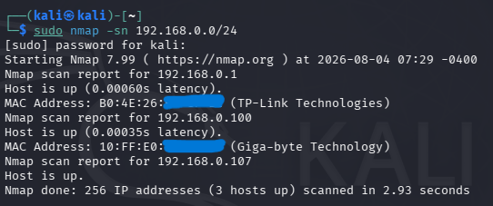
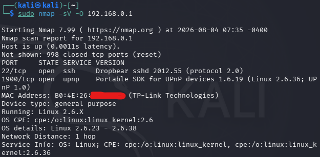
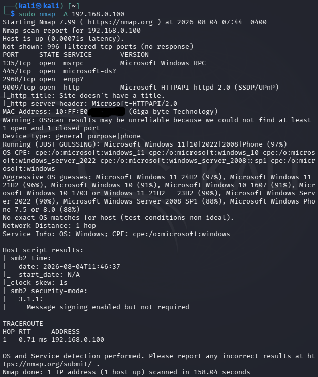

## Аудит безопасности домашней сети c помощью Kali Linux и сканера Nmap
Практическая лабораторная работа по исследованию локальной сети b обнаружению активных хостов с использованием Kali Linux и сканера Nmap.

## 🎯 Цели работы
1. Разобраться как Nmap анализирует сеть, находит активные устройства и определяет открытые порты.
2. Научиться переводить ВМ из режима NAT в Bridged для полноценной работы в локальной подсети.
3. Запустить сканер и обнаружить активные устройства в домашней подсети
4. Просканировать каждый элемент сети и выделить ключевые характеристики и отличия между ними


## 🛠️ Используемое окружение
* **Основная ОС:** Windows 11 (host)
* **Гипервизор:** Oracle VirtualBox
* **Гостевая ОС:** Kali Linux
* **Сканер:** Nmap

## 🚀 Ход выполнения работы


### Этап 1. Сетевая разведка и настройка окружения

Сначала я использовал команду **ip r**, чтобы определить адрес шлюза и границы моей подсети.

**Проблема с NAT**

Однако я столкнулся с проблемой, изначально виртуальная машина работала в режиме **NAT**(Network Address Translation), в этом режиме Kali находилась в изолированной виртуальной сети и не могла видеть другие физические устройства в моём доме.

**Решение в Bridged**


Для решения этой проблемы я переключил сетевой адаптер в режим **Bridged**.
**режим моста** — это настройка сети, при которой устройство или ВМ работает как прозрачный провод. Оно не обрабатывает трафик и не выдает IP-адреса, а просто передает данные напрямую между двумя сегментами сети.
Главное отличие между ними в том, что **NAT** скрывает устройство за главным компьютером (хостом) и заменяет его адрес, а **Bridged** делает устройство полноценным и независимым участником сети со своим собственным уникальным адресом.

**Решение неполадок со стороны адаптера**

После переключения режима, интернет в Kali пропал, причиной этому стало ошибочным использованием виртуального адаптера **Radmin VPN**, вместо моего реального **Gigabit Realtek Ethernet** порта, после выбора правильного адаптера, связь восстановилась.

### Этап 2. Первичное сканирование и обнаружение хостов

После настройки окружения и получения действительного адреса шлюза, я приступил к сканированию подсети командой 
```bash 
sudo nmap -sn 192.168.0.0/24
```

что позволило создать карту активных устройств в сети:



### Этап 3. Углублённый анализ устройств

Дальше, согласно полученной карте я начал точечно сканировать каждого из участников. 
для маршрутизатора была использована команда: 
```bash
sudo nmap -sV -O 192.168.0.1
```
где флаг **-sV** активирует определение названий и версий запущенных служб, а флаг **-O** включает определение операционной системы.

.

Также было проведено сканирование с флагом -A, что значит Aggressive scan, представляет из себя "всё в одном", и включает сразу несколько мощных проверок такие как **-sV**, **-O**, **-sC**(встроенные скрипты безопасности), а также 
**--traceroute**(трассировку маршрута), а проводилось оно на.. как выяснилось из результатов — основной ОС.
.


